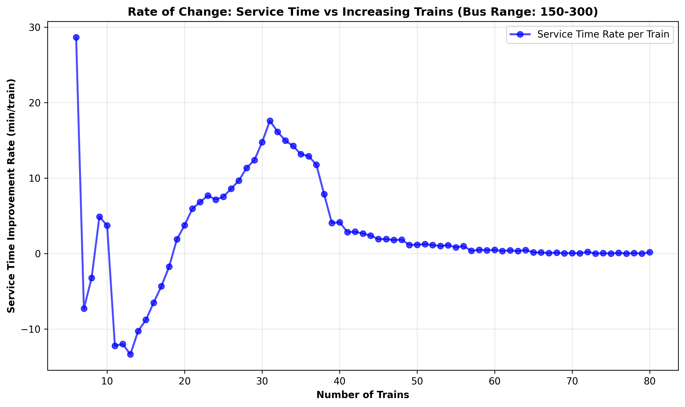
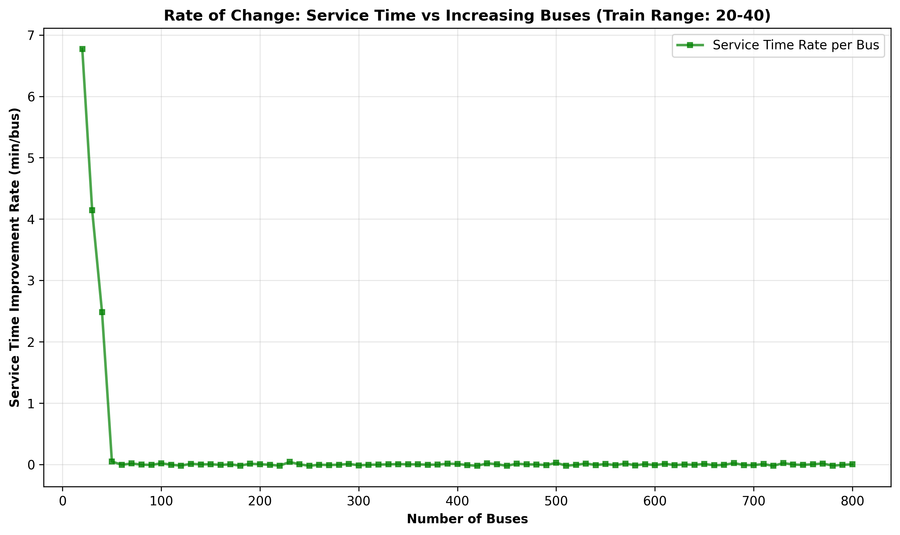
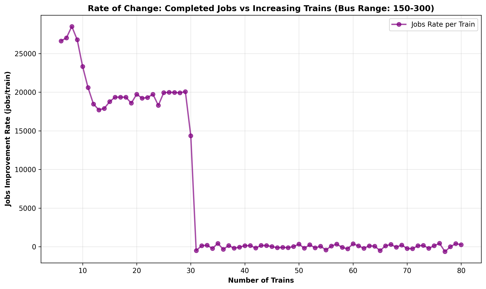
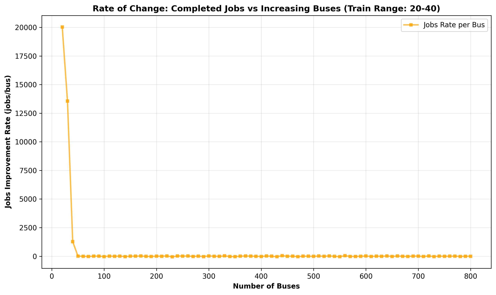
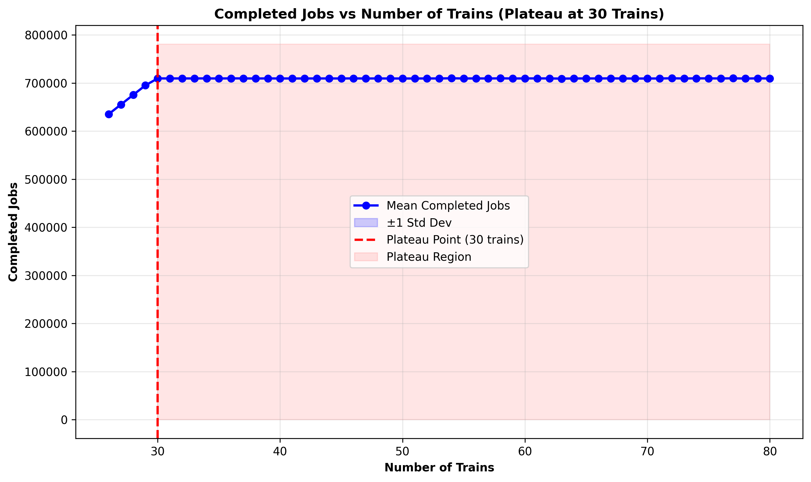
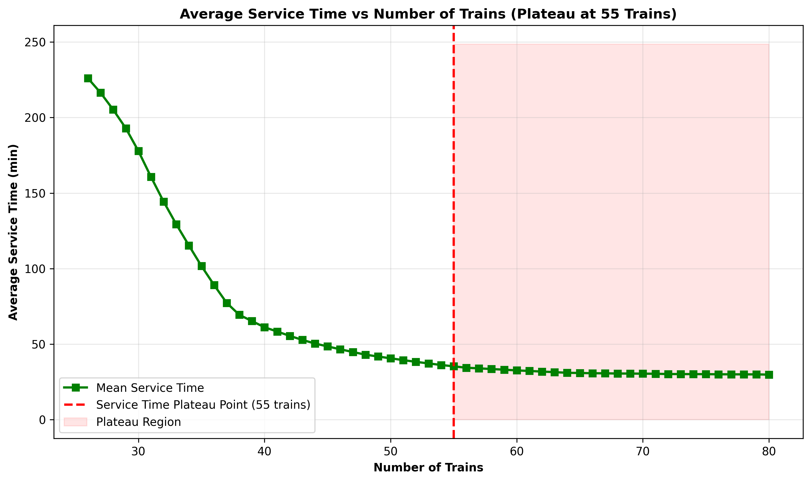
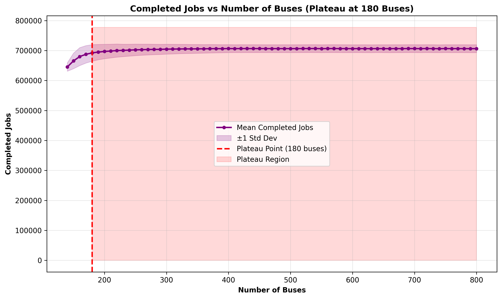
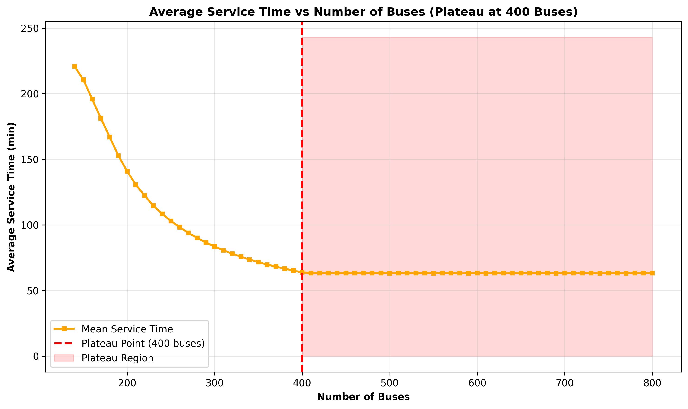
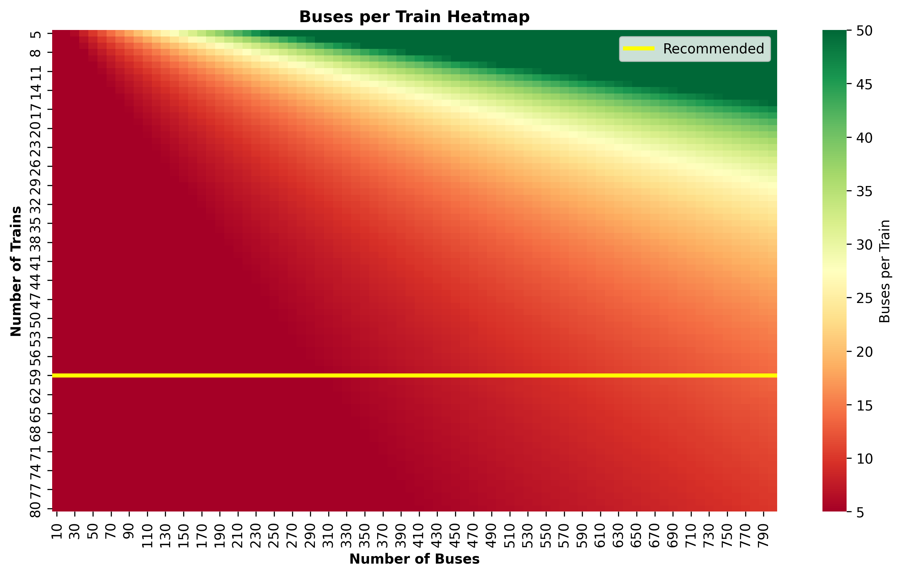

# Multimodal DC Metro Optimization Simulation

A comprehensive simulation and optimization framework for analyzing high-speed rail and bus transportation networks in the Washington D.C. metropolitan area. This project uses discrete-event simulation and queueing theory to model passenger flow through a multi-modal transit system and identifies optimal fleet configurations.

The project simultaes a "Straight Line" route from Frederick, MD, traveling down the I-270 corridor to **Washington, D.C.** with 8 stations in between.

## Project Overview

This project simulates a hub-and-spoke transit system where:
- **Buses** collect passengers from local areas and bring them to train stations
- **Trains** transport passengers between major stations along a high-speed rail line
- The system serves **895,266 workers** across 8 stations from Frederick, MD to Washington, D.C.

The simulation models realistic operational constraints including:
- Time-of-day demand patterns (peak hours, off-peak, late night)
- Station dwell times with parallel boarding through multiple doors
- Train headway constraints
- Bus route distances based on station population density
- 28-hour simulation duration (24 hours of passenger generation + 4 hours clearance)

## Key Findings

### Optimal Configuration
Based on analysis of thousands of fleet configurations, the **minimum viable fleet** that meets the 70% service level requirement is:

- **55 Trains** (1,000 passenger capacity, 250 km/h speed)
- **280 Buses** (50 passenger capacity, 75 km/h speed)
- **Service Level**: 79.1% of workers served (708,092 completed trips)
- **Average Service Time**: 35.24 minutes
- **Efficiency**: 2,113.71 jobs per vehicle

### Critical Discoveries

1. **Train-Limited System**: The system is train-limited, not bus-limited. Adding trains provides linear improvements in throughput, while buses plateau around 180-400 units.

2. **Plateau Points**:
   - **Jobs plateau at 30 trains**: Beyond 30 trains, completed jobs stabilize around 700,000, but service time continues improving
   - **Service time plateaus at 55 trains**: After 55 trains, additional trains provide minimal service time improvements
   - **Bus plateau at 180 buses**: Jobs plateau when buses reach ~180 units
   - **Bus service time plateau at 400 buses**: Service time improvements diminish after 400 buses

3. **Operational Bottleneck**: The original simulation revealed a "dwell time trap" where trains spent 6+ minutes at stations due to sequential boarding. This was solved by modeling parallel boarding through multiple doors (10x faster boarding).

## Project Structure

```
├── src/                    # Java simulation source code
│   ├── Main.java          # Main entry point, runs parameter sweep
│   ├── Simulation.java    # Core simulation engine
│   ├── BatchServerQueue.java  # Train queueing logic
│   ├── Station.java       # Station and passenger generation
│   └── ...
├── csv/
│   ├── stations.csv       # Station configuration (population, workers, distances)
│   ├── results.csv        # Simulation results (all configurations)
│   └── optimal_configuration.csv  # Recommended configuration
├── plot/                  # Generated visualizations
│   ├── 1-4_rate_of_change_*.png  # Rate of change analysis
│   ├── 5_buses_per_train_heatmap.png
│   ├── 6-9_*_plateau.png  # Plateau analysis plots
│   └── 10_summary_statistics.txt
├── optimized.py           # Python analysis and visualization script
└── requirements.txt       # Python dependencies
```

## How to Run

### Prerequisites

- **Java JDK 8+** (for simulation)
- **Python 3.7+** (for analysis)
- Python packages: `pandas`, `matplotlib`, `seaborn`, `numpy`

### Step 1: Compile Java Simulation

```bash
javac -d out/production/MultiModal-DC-Metro-Optimization-Simulation src/*.java
```

### Step 2: Run Simulation

The simulation tests multiple fleet configurations in parallel:

```bash
java -cp out/production/MultiModal-DC-Metro-Optimization-Simulation Main
```

## Cloud Execution (GitHub Actions)

This repository includes a CI/CD pipeline (.github/workflows/run-simulation.yml) that:

1. Provisions a Linux runner.

2. Compiles the Java application.

3. Executes the full simulation suite (testing hundreds of fleet combinations).

4. Runs the Python optimization analysis.

5. Uploads the results (csv and plot folders) as a downloadable artifact.

### To trigger a run:

1. Go to the Actions tab in this repository.

2. Select the Run Simulation workflow.

3. Click the Run workflow button.


**Configuration Parameters** (in `Main.java`):
- Train range: 1-80 trains (step size: 1)
- Bus range: 1-800 buses (step size: 10)
- Simulation duration: 28 hours (1680 minutes)
- Train capacity: 1,000 passengers
- Train speed: 250 km/h
- Bus capacity: 50 passengers
- Bus speed: 75 km/h

**Output**: Results are saved to `csv/results.csv` with columns:
- `Trains`, `Buses`
- `AvgServiceTime` (minutes)
- `LongestServiceTime` (minutes)
- `CompletedJobs` (number of successful trips)

**Note**: Full parameter sweep can take 1-3 hours depending on hardware. The simulation uses parallel processing to speed up execution.

### Step 3: Analyze Results

Run the Python optimization script to:
- Identify optimal configuration
- Generate visualizations
- Analyze plateau points and rate of change

```bash
pip install -r requirements.txt
python optimized.py
```

**Output**:
- Visualizations saved to `plot/` directory
- Summary statistics in `plot/10_summary_statistics.txt`
- Optimal configuration in `csv/optimal_configuration.csv`

## Visualizations Explained

### Rate of Change Analysis (Plots 1-4)

These plots show how adding vehicles impacts system performance:

**Plot 1: Service Time Rate vs Trains** (Bus Range: 150-300)
- Shows improvement in service time per additional train
- Helps identify where train additions provide diminishing returns
- X-axis: Number of trains
- Y-axis: Service time improvement rate (min/train)


**Plot 2: Service Time Rate vs Buses** (Train Range: 20-40)
- Shows improvement in service time per additional bus
- Demonstrates bus effectiveness within a fixed train fleet
- X-axis: Number of buses
- Y-axis: Service time improvement rate (min/bus)


**Plot 3: Jobs Rate vs Trains** (Bus Range: 150-300)
- Shows increase in completed jobs per additional train
- Critical for understanding train-limited bottlenecks
- X-axis: Number of trains
- Y-axis: Jobs improvement rate (jobs/train)


**Plot 4: Jobs Rate vs Buses** (Train Range: 20-40)
- Shows increase in completed jobs per additional bus
- Helps identify bus saturation points
- X-axis: Number of buses
- Y-axis: Jobs improvement rate (jobs/bus)


### Plateau Analysis (Plots 6-9)

These plots demonstrate where system performance plateaus:

**Plot 6: Jobs vs Trains Plateau**
- Shows completed jobs plateauing at **30 trains** (~700,000 jobs)
- Vertical red line marks the plateau point
- Shaded region indicates plateau zone
- **Key Insight**: Adding trains beyond 30 doesn't increase throughput, but improves service time

**Plot 7: Service Time vs Trains Plateau**
- Shows service time continues improving beyond 30 trains
- Plateaus at **55 trains**
- **Key Insight**: Trains improve service time even after jobs plateau

**Plot 8: Jobs vs Buses Plateau**
- Shows completed jobs plateauing at **180 buses**
- Demonstrates bus saturation point
- **Key Insight**: System is train-limited, not bus-limited

**Plot 9: Service Time vs Buses Plateau**
- Shows service time plateauing at **400 buses**
- **Key Insight**: Buses have diminishing returns for both metrics

### Heatmap (Plot 5)

**Buses per Train Heatmap**
- Color-coded visualization of bus-to-train ratios
- Helps identify reasonable fleet configurations
- Yellow lines mark recommended configuration
- **Key Insight**: Optimal ratio is ~5-10 buses per train

## Technical Details

### Simulation Model

- **Discrete-Event Simulation**: Event-driven model tracking passenger arrivals, boarding, travel, and alighting
- **Queueing Theory**: M/M/c queues for stations, batch service for trains
- **Exponential Arrivals**: Poisson process with time-of-day multipliers
- **Parallel Boarding**: Models multiple doors (10x faster than sequential)

### Optimization Method

The optimization uses a **lexicographical sorting** approach:
1. **Hard Constraint**: Must meet 70% service level (626,686+ completed jobs)
2. **Soft Constraint**: Service time within 20% of best among valid configs
3. **Minimization**: Sort by trains (ascending), then buses (ascending)
4. **Result**: Minimum viable fleet that satisfies all constraints

### Performance Metrics

- **Completed Jobs**: Number of passengers who complete their trip
- **Service Time**: Average time from passenger creation to destination arrival
- **Service Level**: Percentage of workers served (completed jobs / total workers)
- **Efficiency**: Completed jobs per vehicle (throughput efficiency)

## Station Configuration

The system models 8 stations along the DC Metro corridor:

| Station | Distance (km) | Population | Workers |
|---------|--------------|------------|---------|
| Frederick | 0 | 85,793 | 24,459 |
| Urbana | 13.7 | 11,985 | 3,490 |
| Germantown | 30.2 | 91,749 | 26,112 |
| Gaithersburg | 37.6 | 69,472 | 74,274 |
| Rockville | 45.0 | 67,297 | 81,479 |
| Silver Spring | 62.1 | 81,410 | 57,555 |
| College Park | 68.9 | 34,187 | 70,144 |
| Washington D.C. | 76.5 | 670,050 | 557,753 |

**Total Workers**: 895,266

## Key Improvements Made

1. **Reduced Dwell Times**: Changed boarding time from 0.5s/person to 0.05s/person (parallel boarding through multiple doors)
2. **Extended Simulation**: Increased from 24 to 28 hours to allow late-night passengers to complete trips
3. **Generation Cutoff**: Stop generating new passengers at 24 hours while processing existing ones
4. **Optimization Refinement**: Switched from composite scoring to minimum viable fleet approach

## Results Summary

The simulation successfully identifies the **minimum viable fleet configuration** that:
- ✅ Meets 70% service level requirement (79.1% achieved)
- ✅ Minimizes fleet size (55 trains, 280 buses)
- ✅ Provides acceptable service time (35.24 min average)
- ✅ Demonstrates clear plateau points for both vehicle types

## Future Work

- Explore different train/bus capacity configurations
- Model variable headway strategies
- Analyze cost-benefit tradeoffs
- Extend to multi-line networks
- Incorporate real-time demand adjustments

## License

This project was developed as a CMIS202 Capstone Project by **Ayush Regmi**. 
